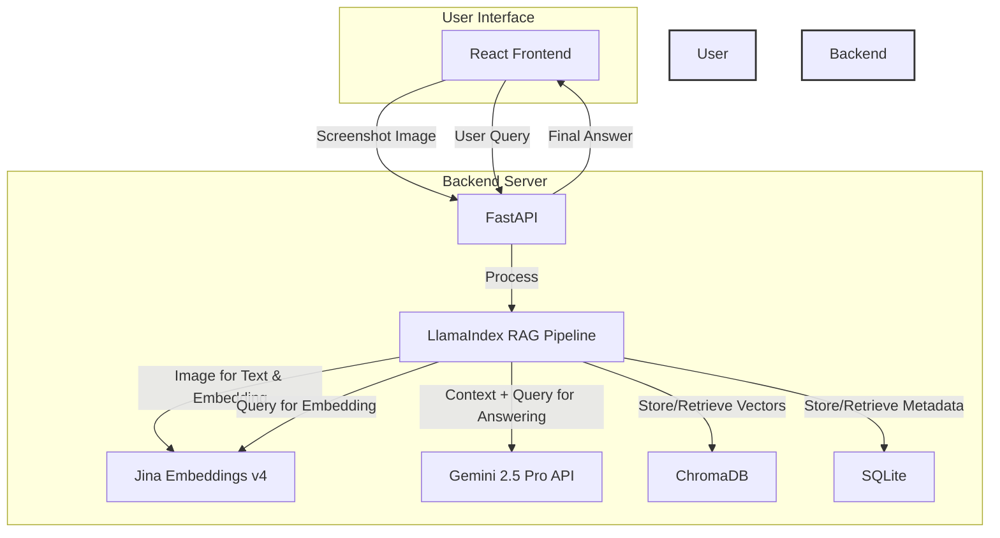
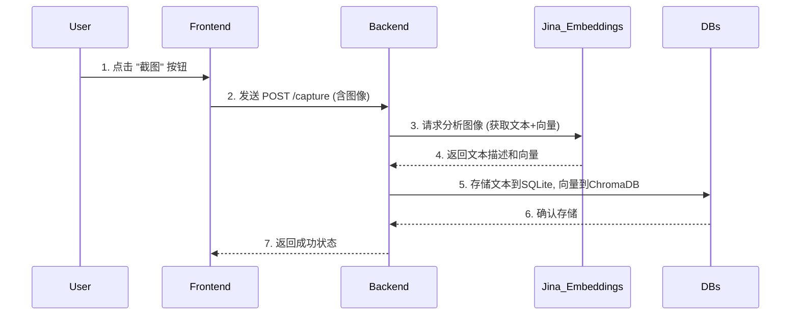
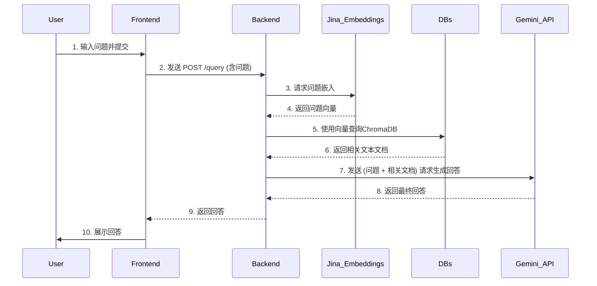

# DESIGN - QuickCaptureRAG DemoV1

本文档基于 `CONSENSUS_DemoV1.md` 的最新版本，提供 Demo V1 的系统架构设计、接口规范和数据流。

## 1. 整体架构图 (Overall Architecture)

系统分为两大核心组件：
1.  **`app-frontend`**: 基于 Tauri 和 React 的桌面客户端，负责用户交互。
2.  **`app-backend`**: 基于 Python 和 FastAPI 的后端服务，负责编排 AI 模型调用和数据存储。

## 2. 核心组件与职责 (Core Components & Responsibilities)

- **React Frontend (`app-frontend`):**
  - 提供UI界面，包含“截图”按钮和问答区。
  - 通过HTTP请求与 `app-backend` 通信。

- **FastAPI Backend (`app-backend`):**
  - 提供 `/capture` 和 `/query` API端点。
  - 封装所有业务逻辑。
  - 管理与 Jina, Gemini, ChromaDB, 和 SQLite 的交互。

- **LlamaIndex RAG Pipeline:**
  - 编排整个 RAG 流程。
  - **捕获阶段**: 调用 Jina Embeddings v4 处理图像，获取文本和向量。
  - **查询阶段**: 调用 Jina Embeddings v4 嵌入问题，从 ChromaDB 检索文档，最后调用 Gemini 2.5 Pro API 生成答案。

- **Jina Embeddings v4:**
  - **核心多模态模型**。
  - 接收图像，同时输出图像的**文本描述**和**向量嵌入**。
  - 接收文本问题，输出其**向量嵌入**。

- **Gemini 2.5 Pro API:**
  - **纯文本生成模型**。
  - 接收“用户问题”和“检索到的上下文”，生成最终的自然语言回答。

## 3. 接口契约定义 (API Contract)

接口定义保持不变。

### 3.1. 截图处理 `POST /capture`
- **功能:** 接收截图，调用Jina处理，并存入知识库。

### 3.2. 问答查询 `POST /query`
- **功能:** 接收用户问题，执行RAG流程并返回AI回答。

## 4. 数据流向图 (Data Flow)

### 截图流程 (Capture Flow)

### 查询流程 (Query Flow)

## 5. 数据模型 (Data Models)

数据模型保持不变。

- **SQLite (`knowledge_base` table):**
  - `id`, `doc_id`, `content` (由Jina生成), `created_at`
- **ChromaDB:**
  - 存储由 Jina 生成的向量嵌入。

## 6. 异常处理策略 (Exception Handling)

异常处理策略保持不变，但需覆盖 Jina API 和 Gemini 2.5 Pro API 调用失败的情况。