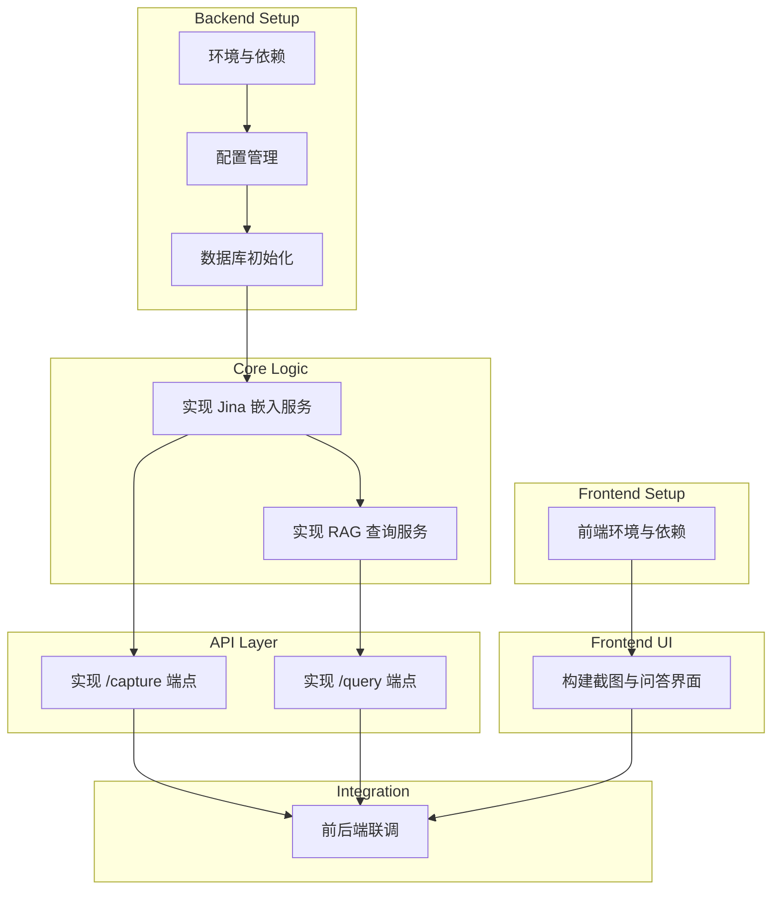

# TASK - QuickCaptureRAG DemoV1

本文档基于 `DESIGN_DemoV1.md`，将 Demo V1 的开发工作分解为一系列原子化的、可执行的任务。

## 任务依赖图 (Task Dependency Graph)

## 原子任务清单 (Atomic Task List)

---

### **T1: [Backend] 环境与依赖初始化**

- **输入契约:** `app-backend/` 目录存在。
- **实现约束:**
  - 在 `app-backend/` 目录��创建并激活 Python 虚拟环境 (`.venv`)。
  - 根据 `app-backend/requirements.txt` 安装所有必要的 Python 库，包括 `fastapi`, `uvicorn`, `llama-index`, `chromadb`, `python-dotenv`, 以及 Jina AI 相关的库。
- **输出契约:** 虚拟环境配置完毕，所有依赖成功安装。
- **验收标准:** 在激活虚拟环境后，可以成功 `import` 所有核心库。

---

### **T2: [Backend] 配置管理模块**

- **输入契约:** T1 完成。
- **实现约束:**
  - 创建一个模块 (例如 `config.py`) 用于加载根目录 `.env` 文件中的环境变量。
  - 确保 `GEMINI_API_KEY` 和 Jina AI 可能需要的配置能够被安全加载。
- **输出契约:** 一个可供全局引用的配置对象或函数。
- **验收标准:** 在后端应用中可以成功获取到 `.env` 文件中配置的 `GEMINI_API_KEY`。

---

### **T3: [Backend] 数据库初始化模块**

- **输入契约:** T2 完成。
- **实现约束:**
  - 创建一个模块 (例如 `database.py`) 负责初始化 ChromaDB 和 SQLite。
  - ChromaDB 客户端应配置为使用 `data/chroma_db` 目录进行持久化存储。
  - SQLite 数据库应在首次运行时自动创建 `knowledge_base` 表。
- **输出契约:** 可供其他模块调用的数据库客户端实例。
- **验收标准:** 应用启动后，`data/chroma_db` 目录被创建，SQLite 数据库文件和表结构正确生成。

---

### **T4: [Backend] 实现 Jina 嵌入服务**

- **输入契约:** T3 完成。
- **实现约束:**
  - 创建一个服务模块 (例如 `services.py`)。
  - 封装 Jina Embeddings v4 模型。
  - 提供一个函数 `embed_image(image_data)`，接收图像数据，返回包含 `text` 和 `embedding` 的字典。
  - 提供一个函数 `embed_text(text_data)`，接收文本，返回其 `embedding`。
- **输出契约:** 两个封装好的嵌入函数。
- **验收标准:** 单元测试证明，传入图像或文本数据，能返回符合预期的文本描述和向量。

---

### **T5: [Backend] 实现 RAG 查询服务**

- **输入契约:** T4 完成。
- **实现约束:**
  - 在 `services.py` 中，基于 LlamaIndex 构建 RAG 查询管道。
  - 配置 RAG 管道的 Retriever 部分，使其能从 ChromaDB 中检索文档。
  - 配置 RAG 管道的 LLM 部分，使其使用 `Gemini 2.5 Pro` API。
  - 提供一个函数 `generate_answer(query)`，接收用户问题，执行完整的 RAG 流程，返回最终答案。
- **输出契约:** 一个封装好的问答生成函数。
- **验收标准:** 单元测试证明，传入一个问题，函数能够从数据库检索上下文并调用 Gemini API 返回一个答案。

---

### **T6: [Backend] 实现 /capture API 端点**

- **输入契约:** T4 完成。
- **实现约束:**
  - 在 `main.py` 中创建 `POST /capture` 端点。
  - 端点接收上传的图像文件。
  - 调用 `embed_image` 函数处理图像。
  - 将返回的文本和向量分别存入 SQLite 和 ChromaDB。
- **输出契约:** 一个功能完整的 `/capture` API。
- **验收标准:** 通过 API 测试工具 (如 Postman) 发送图像文件，能够得到 `200 OK` 响应，并且数据成功写入数据库。

---

### **T7: [Backend] 实现 /query API 端点**

- **输入契约:** T5 完成。
- **实现约束:**
  - 在 `main.py` 中创建 `POST /query` 端点。
  - 端点接收包含 `question` 字段的 JSON 数据。
  - 调用 `generate_answer` 函数处理问题。
  - 将生成的答案以 JSON 格式返回。
- **输出契约:** 一个功能完整的 `/query` API。
- **验收标准:** 通过 API 测试工具发送问题，能够接收到由 Gemini 生成的回答。

---

### **T8: [Frontend] 环境与依赖初始化**

- **输入契约:** `app-frontend/` 目录存在。
- **实现约束:**
  - 在 `app-frontend/` 目录下运行 `npm install`。
  - 确保 `react`, `typescript`, `@tauri-apps/api` 等核心依赖成功安装。
- **输出契约:** `node_modules` 目录生成，所有依赖安装完毕。
- **验收标准:** 运行 `npm run tauri dev` 命令，Tauri 开发窗口能够成功启动并显示默认页面。

---

### **T9: [Frontend] 构建截图与问答界面**

- **输入契约:** T8 完成。
- **实现约束:**
  - 在 React 应用中创建一个简洁的 UI 界面。
  - 包含一个明确的“截图”按钮。
  - 包含一个文本输入框用于提问，一个区域用于显示回答。
  - 实现截图按钮的点击逻辑，能够调用 Tauri 的截图 API 或相关库。
- **输出契约:** 一个包含核心交互元素的 React 组件。
- **验收标准:** 在开发窗口中，UI 元素渲染正常，点击截图按钮可以触发截图动作。

---

### **T10: [Frontend/Backend] 前后端联调**

- **输入契约:** T6, T7, T9 全部完成。
- **实现约束:**
  - 在前端实现 API 调用逻辑。
  - “截图”后，将图像数据通过 `fetch` 或 `axios` 发送到后端的 `/capture` 端点。
  - “提问”后，将问题发送到后端的 `/query` 端点，并接收和展示返回的答案。
  - 处理加载状态和错误状态，并在 UI 上给予用户反馈。
- **输出契约:** 一个功能完整的、前后端打通的 DemoV1 应用。
- **验收标准:**
  - 用户可以完成一次从截图到存储的完整操作。
  - 用户可以针对已存储的内容提问，并成功在界面上看到 AI 的回答。
  - 整个流程运行顺畅。